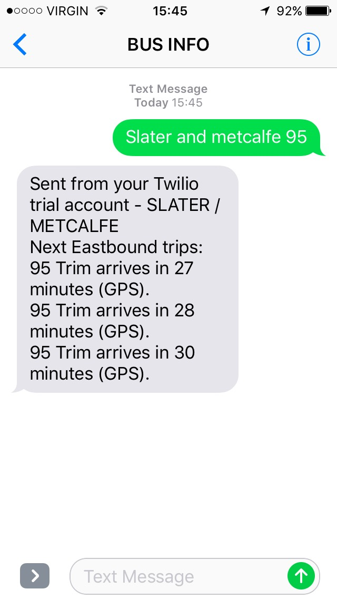

# live bus texts

This project allows an Ottawa resident to text a local number with a bus stop name and route number, to find out what times the next three buses are coming (with live updates).

## Example Usage

Suppose you want to find out what time the next <i>95</i> bus arrives at <i>Slater and Metcalfe</i> :

All times with <i>(GPS)</i> after them indicate that the arrival time is GPS-adjusted, aka the "live" time. Any times with <i>(not GPS)</i> after them indicate that GPS is not currently available for this bus, so the time displayed is the scheduled arrival time, aka not the "live" time.

The number to text is currently private. If you would like to try this out for yourself, send me a message and I can add your phone number to the list of verified numbers.

## APIs Used

The OC Transpo Developers API is used for getting GPS-updated live times of next arriving buses. The Twilio API is used to send and receive text messages.
